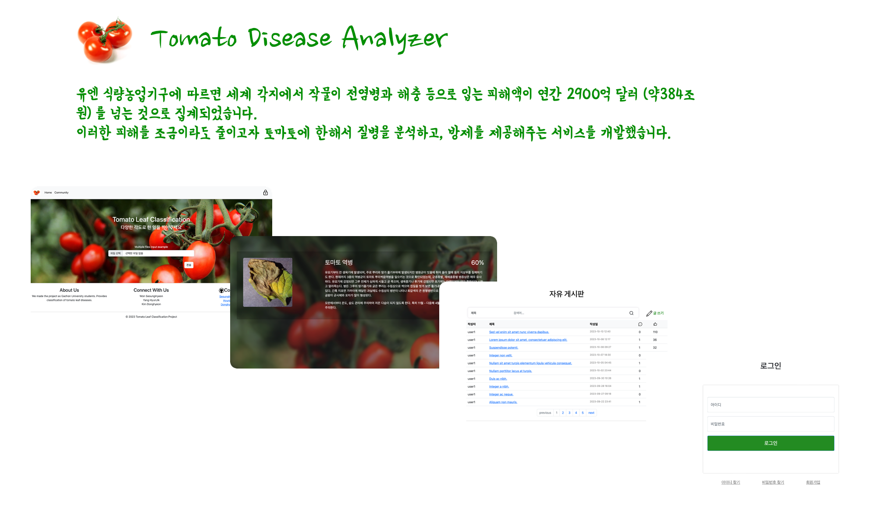
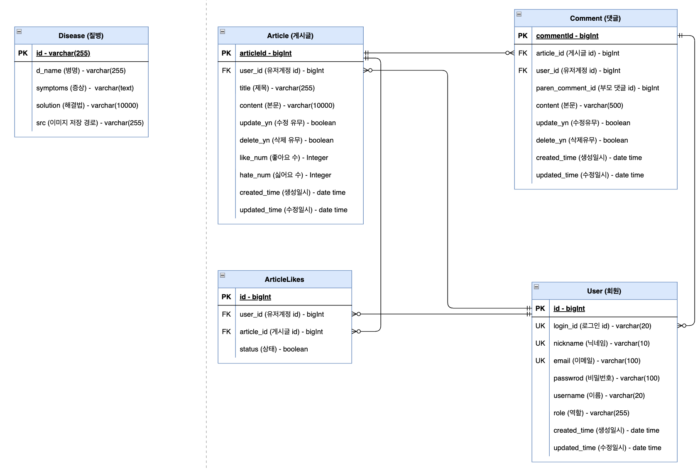
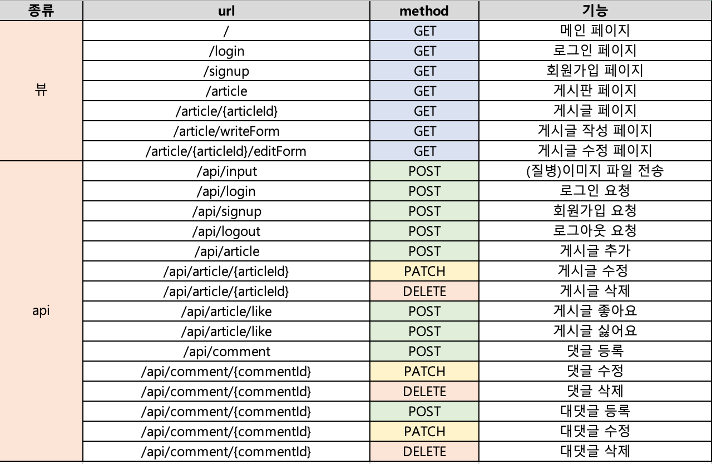

# Tomato Disease Analyzer

 
토마토의 질병을 이미지 분류 인공지능을 통해 분석 및 해결법을 제시해주고, 이용자들의 정보 공유를 위한 커뮤니티 기능을 제공해주는 웹 사이트  

##  구현기능 설명

###  질병 분석 및 해결방안 제시
CNN 기반 이미지 분류 모델인 Densenet을 이용하여 사용자가 전송한 이미지를 통해 토마토의 질병을 분석해 줍니다.  
분석된 결과를 토대로 해결방안을 제시해줍니다.

###  회원가입 및 로그인 기능
게시글/댓글 작성 및 추천 기능을 이용하기 위해 회원가입 및 로그인 기능을 구현했습니다. 

###  커뮤니티 기능
농작물을 제배하는 사람들을 위한 커뮤니티 기능을 제공합니다. 
사용자들은 자유롭게 의견을 공유할 수 있고, 게시글에 추천 또는 비추천을 할 수 있습니다.

###  게시물 검색 기능
제목/본문/작성자로 특정 게시물을 검색할 수 있습니다. 
사용자들은 본인이 원하는 게시물을 좀 더 쉽게 찾을 수 있습니다.

## 개발 도구

##  데이터베이스 구조

 

##  API 명세서

##  역할 분담

### 인공지능
- 김동현: 인공지능 학습 및 플라스크 서버 설계, 게시물 추천 기능 구현
- 양현직: 인공지능 학습

### 웹 서비스
- 원승현: 스프링 서버, DB 설계 및 타임리프를 이용한 뷰 구현과 배포
